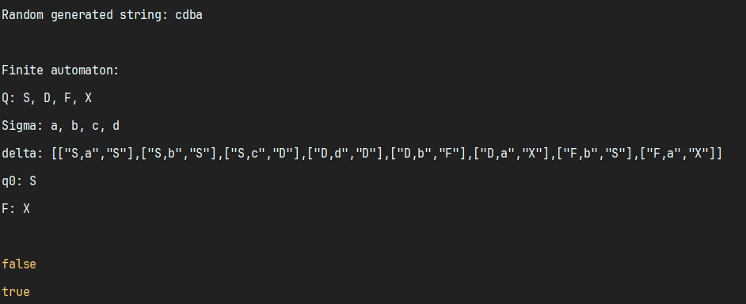

# Lab Report: Intro to Formal Languages and Finite Automata

### Course: Formal Languages & Finite Automata
### Author: Nicolai Petcov

---

## Overview
This lab focuses on understanding formal languages, regular grammars, and finite automata. We explore the components of formal languages, implement a grammar, generate valid strings, convert the grammar to a finite automaton, and verify if strings belong to the language.

---

## Objectives

1. **Understanding Formal Languages**:  
   A formal language consists of:
    - **Alphabet (VT)**: Set of valid characters.
    - **Vocabulary**: Set of valid words.
    - **Grammar (P)**: Set of rules/constraints.

2. **Project Setup**:
    - Created a GitHub repository to store and manage the project.
    - Chose Java for implementation due to its robustness and familiarity.
    - Reports are stored separately for easy verification.

3. **Grammar Implementation**:
    - **Variant 22 Grammar Definition**:
        - Non-terminal symbols (VN): \( \{S, D, F\} \)
        - Terminal symbols (VT): \( \{a, b, c, d\} \)
        - Production rules (P):
          - S → aS     
          - S → bS    
          - S → cD   
          - D → dD    
          - D → bF  
          - D → a
          - F → bS
          - F → a

    - **Tasks Completed**:
        - Implemented a `Grammar` class to define and manage the grammar.
        - Added a function to generate 5 valid strings.
        - Converted the grammar to a finite automaton.
        - Implemented a method in the finite automaton to check string validity.

---
## Implementation

### 1. Grammar Class
Implemented a class `Grammar` with methods to generate valid strings and convert the grammar to a finite automaton.
#### Here is my `generateString` method:
```typescript
 public generateString(): string {
        let result = this.startVariable;
        let cursor = 0;

        while (cursor < result.length) {
            const currentChar = result.charAt(cursor);
            if (this.VT.includes(currentChar)) {
                cursor++;
            } else {
                const possibleValues = this.hashMap.get(currentChar);
                if (!possibleValues || possibleValues.length === 0) {
                    throw new Error(`No production rule for non-terminal: ${currentChar}`);
                }
                const replacement = possibleValues[Math.floor(Math.random() * possibleValues.length)];
                result = result.slice(0, cursor) + replacement + result.slice(cursor + 1);
            }
        }

        return result;
    }
```

#### With this method I convert a regular grammar class into finite automaton class:
```typescript
public toFiniteAutomaton(): FiniteAutomaton {
        const sigma = [...this.VT];
        const Q = [...this.VN, "X"];
        const q0 = this.startVariable;
        const finalState = "X";
        const delta = new Map<string, string>();

        this.hashMap.forEach((values, key) => {
            values.forEach(value => {
                if (value.length === 2) {
                    delta.set(`${key},${value.charAt(0)}`, value.charAt(1));
                } else if (value.length === 1) {
                    delta.set(`${key},${value}`, finalState);
                }
            });
        });

        return new FiniteAutomaton(Q, sigma, delta, q0, finalState);
    }
```

### 2. Finite Automaton Class
#### In this class the only method is `stringBelongToLanguag` where we can check if the string can represent a finite automaton according to our rules:

```typescript
public stringBelongToLanguage(inputString: string): boolean {
        let currentState = this.q0;
        for (let i = 0; i < inputString.length; i++) {
            const cursor = inputString.charAt(i);
            const transition = this.delta.get(`${currentState},${cursor}`);
            if (!transition) {
                return false;
            }
            currentState = transition;
        }
        return currentState === this.F;
    }
```

### 3. Main Class
Demonstrated the functionality by generating strings and verifying them.

```typescript
import { Grammar } from './Grammar';
import { FiniteAutomaton } from './FiniteAutomaton';

const VN: string[] = ['S', 'D', 'F'];
const VT: string[] = ['a', 'b', 'c', 'd'];
const startVariable: string = 'S';
const hashMap: Map<string, string[]> = new Map();

hashMap.set('S', ['aS', 'bS', 'cD']);
hashMap.set('D', ['dD', 'bF', 'a']);
hashMap.set('F', ['bS', 'a']);

const grammar = new Grammar(VN, VT, startVariable, hashMap);

console.log("Random generated string: " + grammar.generateString());

const automaton = grammar.toFiniteAutomaton();

console.log("\nFinite automaton: ");
console.log(automaton.toString());

const generatedString = grammar.generateString();
console.log(automaton.stringBelongToLanguage('abcd'));  // Example string for testing
console.log(automaton.stringBelongToLanguage(generatedString));  // Checking if the generated string belongs to the language

```

### Output:


---

## Results

1. **Generated Strings:**
    - Example output of 5 valid strings generated by the grammar:
        - `aacba`
        - `ca`
        - `aaabca`
        - `bbcdba`
        - `abcdbbaaabaacdba`

2. **Finite Automaton Validation:**
    - Tested string `ca` belongs to the language: **True**
    - Tested string `abc`: **False** (not following valid transitions)

---

## Conclusion
In this lab, I successfully:
- Understood the structure and components of formal languages.
- Implemented a grammar based on the provided variant.
- Generated valid strings and converted the grammar to a finite automaton.
- Verified string membership in the language using the finite automaton.

This lab provided practical experience with formal grammars and finite automata, reinforcing theoretical concepts with hands-on coding tasks.

---

## Repository Link
[GitHub Repository](https://github.com/Nicolashaaa/DSL-labs)

---

## References
1. TypeScript Documentation: [https://www.typescriptlang.org/docs/](https://www.typescriptlang.org/docs/)

---